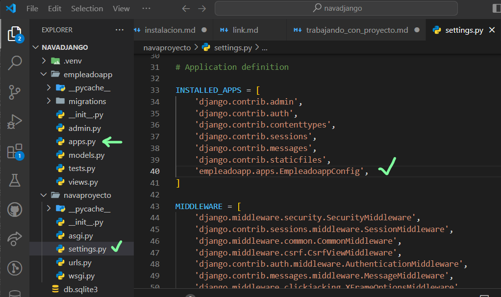
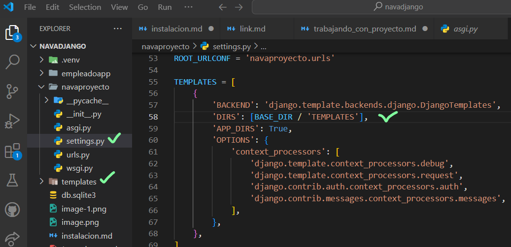
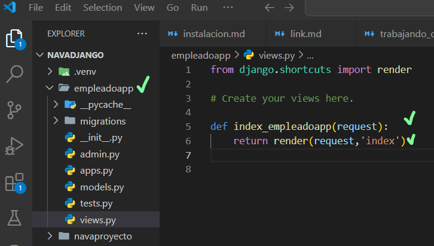
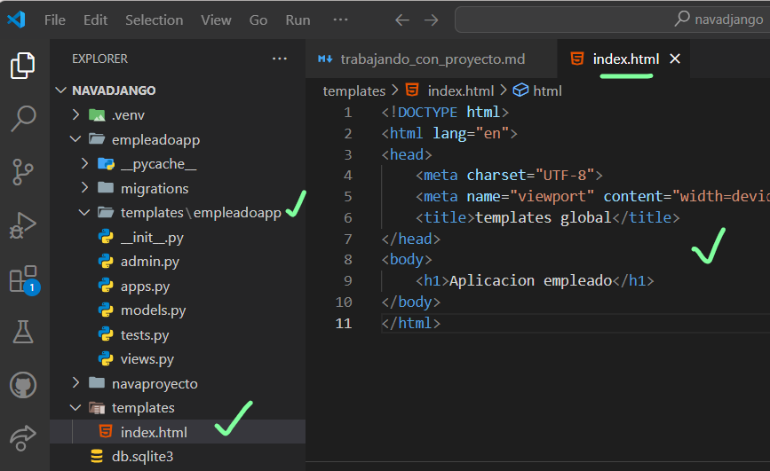
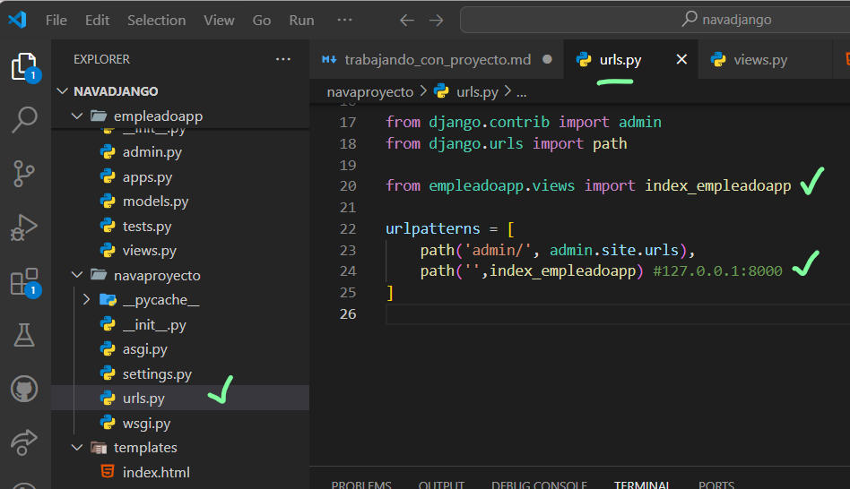
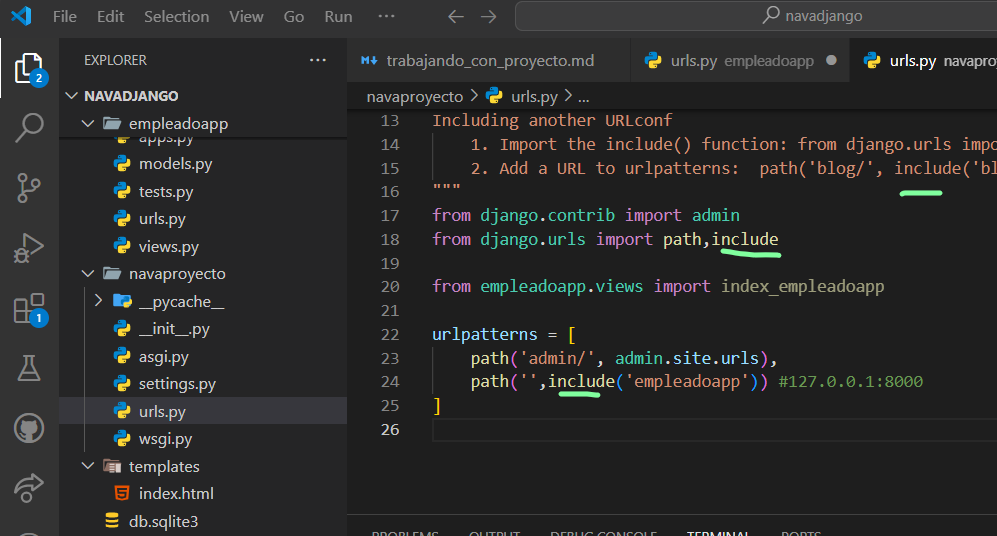
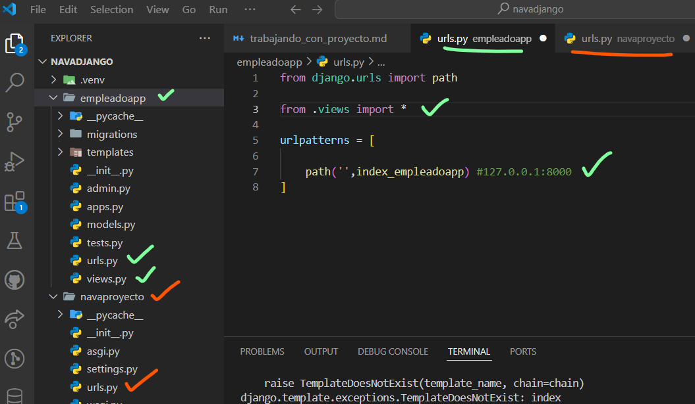

- 10 Agregando la aplicacion al settings django   
- 
-
- En la terminal revisamos el proyecto   --> python manage.py check
- Otra manera de verificar que funciona  --> python manage.py runserver
- Explicando patron MVT django video -->  https://youtu.be/laURuZdJDsU?si=UdLbrPRoUugL8DfS
- 
- Configurando el directorio templates django
- 
- 
- Creando la primer vista basada en funcion django
- 
- 
- Creando el primer template django
- 
-
- Enlazando la vista a las urls django
-
- 
-
- ejecutar servidor y ver en el navegador
-
- Mejorando la gestion de urls django
-
- en urls.py global
- 
- 
- creamos urls.py en empleadoapp y escribimos
-
- 
- revisamos el navegador
- video 18
