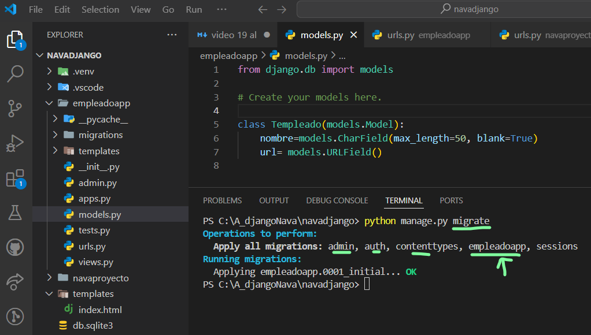

## Primer modelo parte 1 django 
- 
-
## Primer modelo parte 2 django 
- Crear migraciones con makemigrations
- 
- 
- observamos migrations 
-
- 
-
- ahora  migrate
- 
-
-Revisamos db.sqlite3
-
-
-
## Registrando el modelo en el sitio admin django
-
-
-visitamos el sitio admin con runserver
-
-
-
## Comando sqlmigrate django
- realizamos sqlmigrate
- 
- 
## View, Template y URL para crear un favorito django
-
- en templates local creamos
- 
- 
- en vistas views local
-
- 
-
- en urls local
-
- 
- 
- ejecutar servidor
- 
- video 19 al 23
