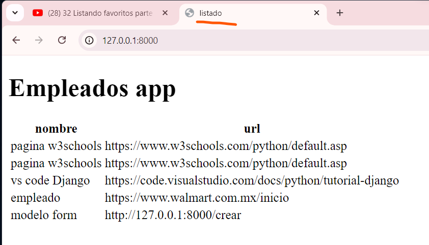
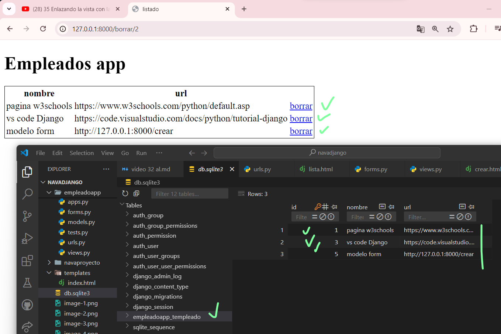

# Listando empleadoapp parte 3 django
- en lista.html
- 
- ejecutamos servidor, miramos el navegador
- 
-
## Preparando template para borrar un empleadoapp django 
- actualizamos lista.html
- 
- 
- en el navegador 
- 
## Creando vista para borrar django 
- en views.py local ? Templeado.objects.get(pk=pk).delete()
- 
-
## Enlazando la vista con la url django
- en urls.py local 
- 
-
- en lista.html
-  
- 
- en el navegador  y panel de desarrollador
- 
## Probando el borrado de empleadosapp django
- en el navegador borrar un registro + ver sqlite3
- 
-
-
