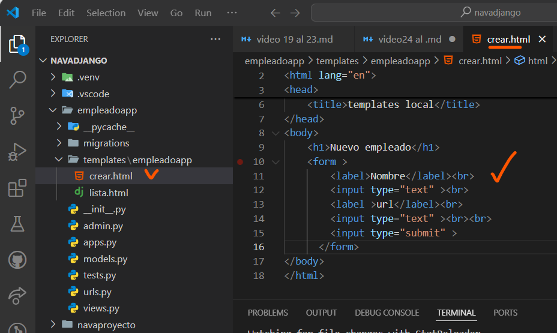
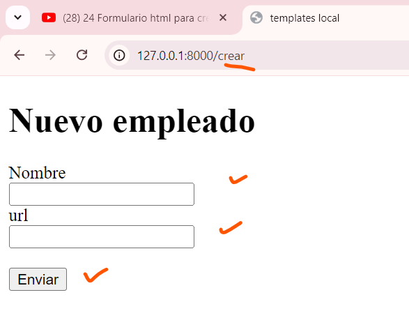
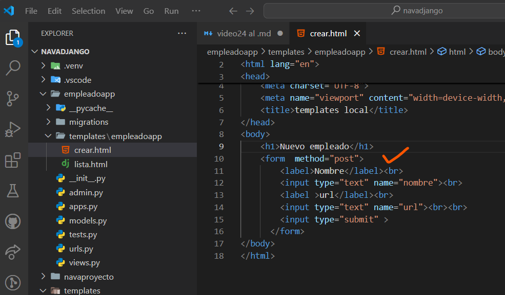
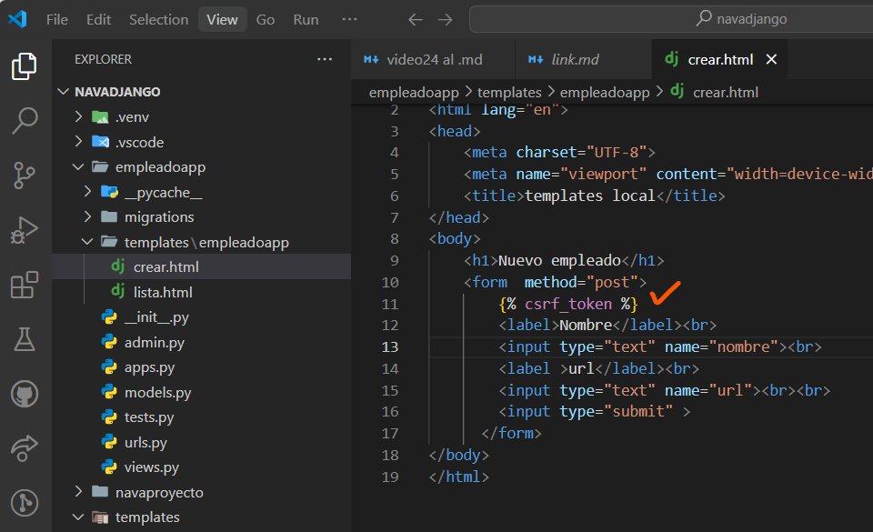
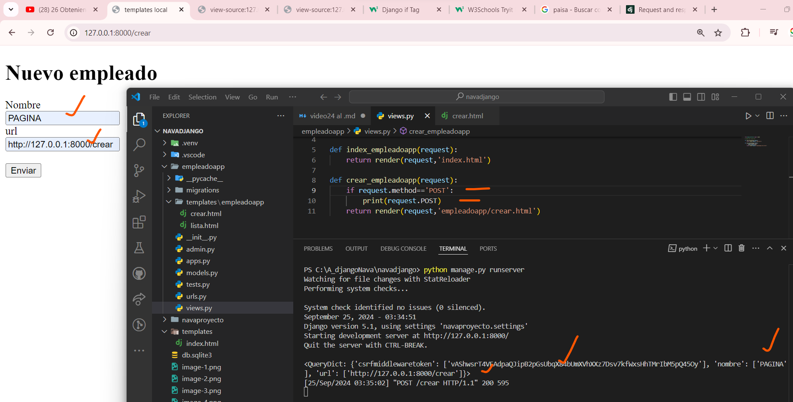
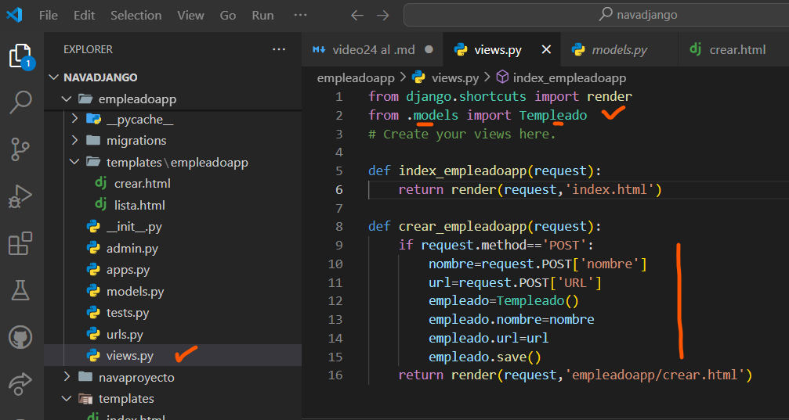
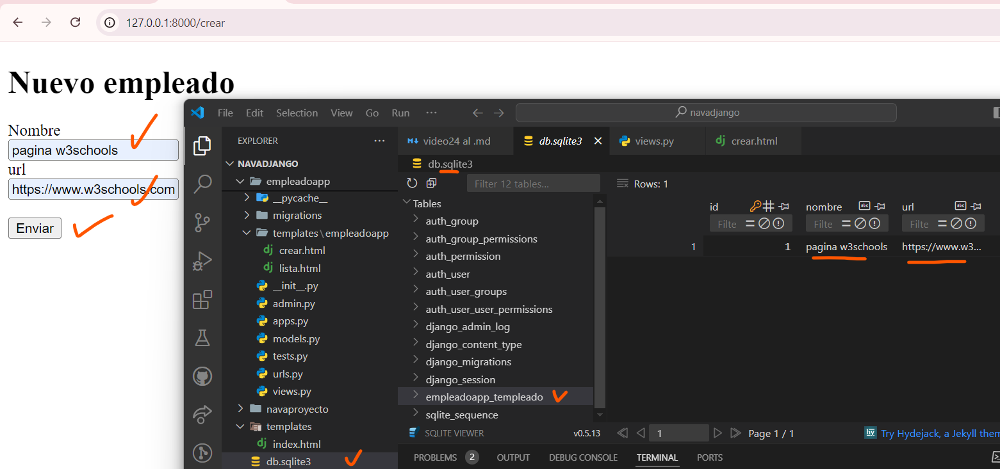
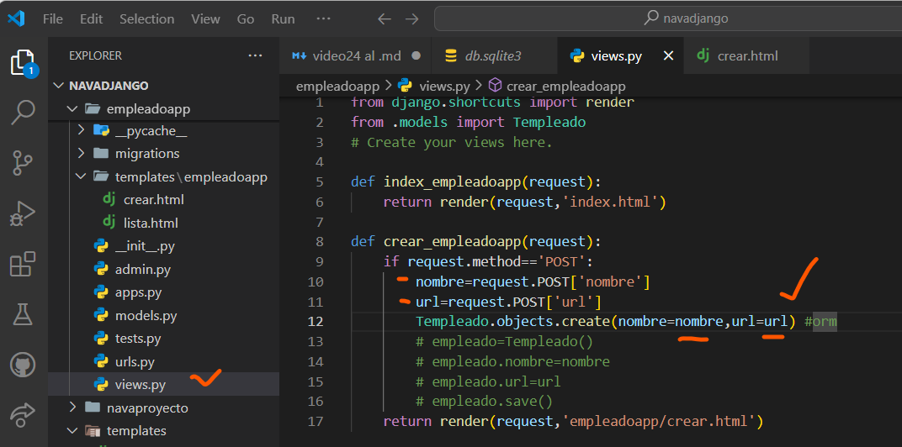
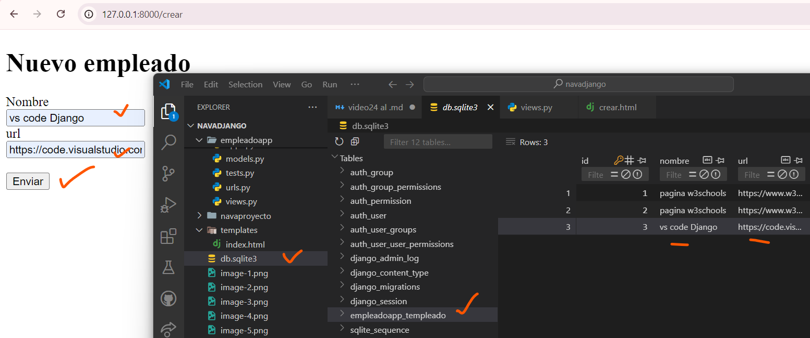

##  Formulario html para crear favorito django
- en crear.html app
- 
- en navegador
-
-metodo post
- 
## csrf token django
-
-
## Obteniendo los datos enviados por POST django
-
- 
-
# Creando nuevos empleadosapp django
- en views local
-  
-  
- revisamos que se guardaron los datos sqlite3
-
- 
-
- en una sola linea de codigo hacemos lo mismo
- 
-
- revisamos que se guardaron los datos sqlite3
-
- 
-