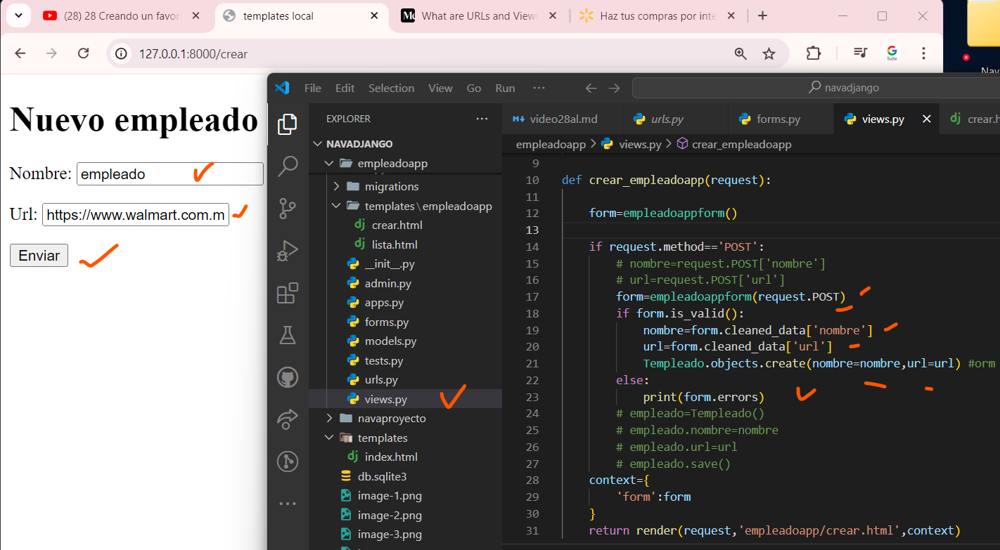

## Creando un empleadoapp desde un Form django
- creamos el archivo forms.py
- 
- 
- en views local
- 
-  
- en el archivo crear.html
- 
-
- agregamos el boton enviar en crear.html
- 
-
-  en  views.py actualizamos
- 
-
- miramos sqlite3
- 
-
## Creando un empleadoapp desde un ModelForm django
- en forms.py
- 
-
- actualizando views.py
-  
- 
- En navegador + sqlite3
-
- 
-
## Listando empleadosapp parte 1 django 
-en lista.html
- 
-
- en views.py actualizamos
- 
- 
- en views.py y en terminal + actualizar navegador
- 
##  Listando empleadoapp parte 2 django
- en views.py + ver terminal + navegador + sqlite3
- 
-
-  actualizamos views.py para ver los datos navegador + terminal +sqlite3
- 
-
- refactorizamos views.py
-
- 
-  
- en lista.html  y miramos en el navegador
- 
- 